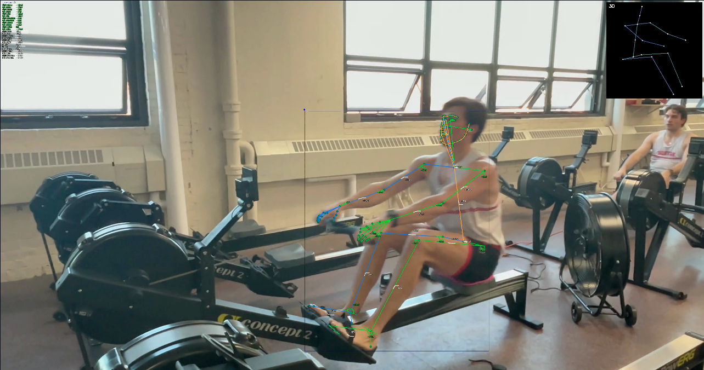
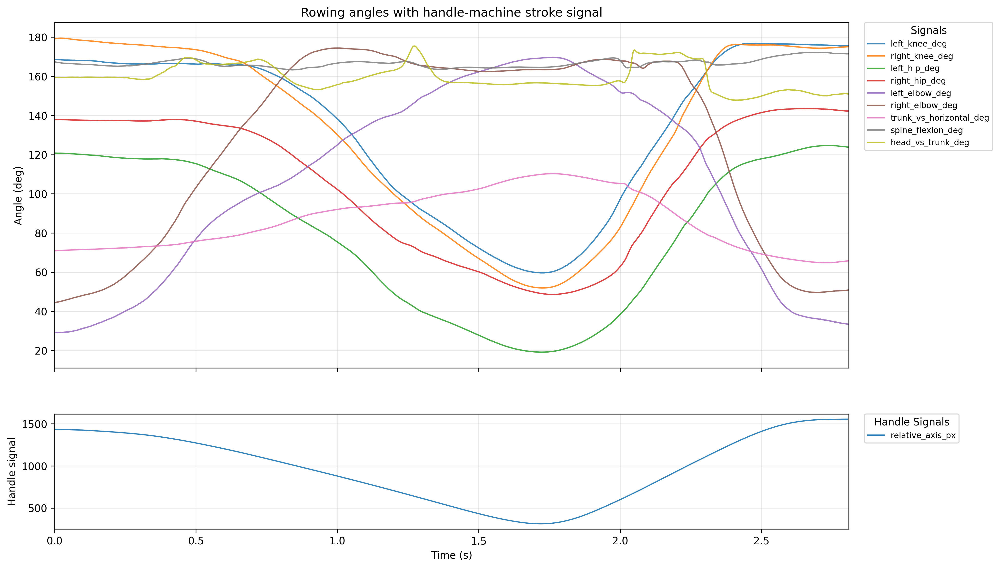
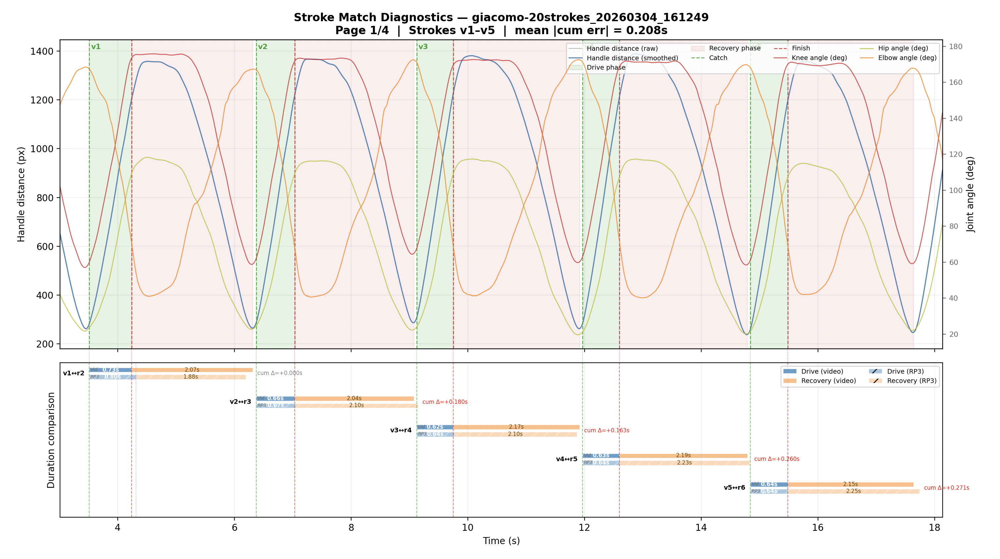
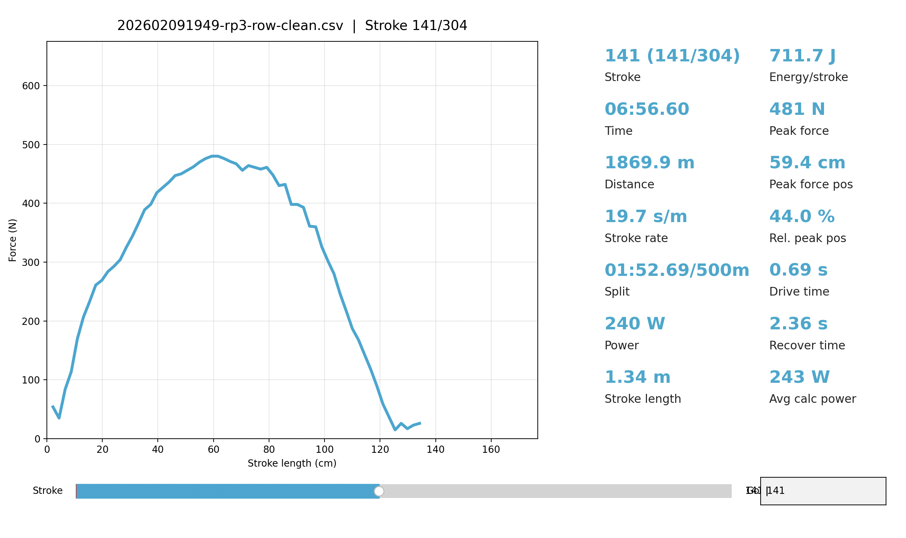

# rowing-video-analysis

`rowing-video-analysis` is a video-first rowing biomechanics pipeline focused on predicting per-stroke force curves from monocular erg videos. During training, it synchronizes two streams: (1) kinematics extracted from video (Sports2D + MotionBERT + handle tracking), and (2) RP3 force exports. At inference time, the same feature contract runs on video only, so no RP3 input is required.

The project is now organized around a unified `rowing` Python package and a Rich terminal menu. The menu drives the full workflow: pose extraction, stroke segmentation, RP3 matching, match editing, segment export, dataset assembly, Stage 0/A/B training, HTML reports, and model-bundle prediction.

The pipeline produces, for each rowing session:

1. Pose and stroke signals from video (Sports2D + MotionBERT + handle/machine tracking).
2. Drive events (catch / finish) inferred from the handle stroke signal.
3. RP3 force-curve matching, with video strokes aligned to RP3 export rows in normalized drive-progress space.
4. Optional match overrides from the visual editor (`match_overrides.json`) for pinned pairs, excluded strokes, and anchor changes.
5. Per-stroke matched segment CSVs with kinematics and force curves on a shared grid.
6. Training dataset artifacts: PCA / FPCA targets, fixed-grid kinematic sequences, masks, QC metadata, and provenance.
7. Stage 0 / A / B model results, portable model bundles, video-only force predictions, and HTML reports.

## Pipeline pages

- [Interactive pipeline visualization](https://jjcappe.github.io/rowing-dynamics-analysis/pipeline-visualisation.html)
- [GitHub Pages index](https://jjcappe.github.io/rowing-dynamics-analysis/)
- [Model training stage diagrams](https://jjcappe.github.io/rowing-dynamics-analysis/model-training-stages.html)

## Visual overview

The figures below are the same visuals used in the docs pipeline walkthrough.






## Current implementation

The seven-phase CLI migration is complete:

1. Repo reorganization: source moved into `src/rowing/`, packaging defined in `pyproject.toml`, old entry points preserved as shim scripts, and import-path hacks removed.
2. Pipeline orchestrator: `rowing.cli.pipeline.run_inference()` exposes the old monolithic inference workflow through `PipelineOptions` and `PipelineResult`.
3. Rich TUI: `python -m rowing` and the `rowing` console script open the top-level menu with run selectors and status badges.
4. Match overrides: `rowing.matching.overrides` reads and writes `<run>/inference/match_overrides.json`, and the matcher honors pinned pairs, excluded strokes, anchor overrides, side overrides, and facing overrides.
5. Visual match editor: `rowing.matching.editor` provides pair remapping, exclude/unpin/anchor actions, live cumulative-drift recompute, and save-and-rerun behavior.
6. Per-run reports: `rowing.reports.run_report` writes `<run>/inference/report/index.html` with detection, match, segment, dataset, and plot sections.
7. Per-training reports: `rowing.reports.training_report` writes `<modeling_dir>/report/index.html` with Stage 0/A/B metrics, residual plots, true-vs-pred overlays, cohort summaries, leakage warnings, and provenance.

## Unified CLI

Install the package in editable mode, then launch the menu:

```bash
python -m venv .venv
source .venv/bin/activate
pip install -U pip
pip install -e .

python -m rowing
```

The editable install also registers the `rowing` console script:

```bash
rowing
```

The menu currently exposes:

1. Pose extraction (Sports2D + MotionBERT).
2. Inference: detect, match, export segments, and optionally build a dataset.
3. Visual match editor for per-run RP3/video alignment edits.
4. Multi-run training dataset build.
5. Stage 0 / A / B model training.
6. Report viewing and regeneration for per-run and per-training reports.
7. Video-only prediction from a saved model bundle.
8. Run management overview.

## Repository layout

```
rowing-video-analysis/
├── pyproject.toml              # `rowing` package + console script
├── README.md
├── session_registry.csv        # video-run ↔ RP3 clean-CSV mapping
├── src/
│   └── rowing/                 # the unified package
│       ├── cli/                # Rich menu, run selectors, status, pipeline orchestration
│       │   ├── __main__.py     # python -m rowing / rowing
│       │   ├── menu.py         # top-level workflow menu
│       │   ├── pipeline.py     # run_inference + PipelineOptions/PipelineResult
│       │   ├── inference.py    # argparse wrapper around the orchestrator
│       │   ├── pose.py         # Sports2D + MotionBERT wizard
│       │   └── overlay.py      # force-curve video overlay
│       ├── pose/               # Sports2D, MotionBERT, handle/machine tracking
│       │   ├── runner.py
│       │   ├── motionbert.py
│       │   ├── stroke_signal.py
│       │   ├── parse.py
│       │   ├── plot_angles.py
│       │   ├── overlay_3d.py
│       │   ├── progress_utils.py
│       │   ├── streamlit_app.py  # original Streamlit UI
│       │   └── kinematics/       # rowing_pose subpackage (unchanged content)
│       ├── matching/
│       │   ├── detect.py        # drive event detection
│       │   ├── match.py         # RP3 stroke matcher (DP)
│       │   ├── overrides.py     # match_overrides.json sidecar support
│       │   ├── editor.py        # interactive matplotlib match editor
│       │   ├── pair_session.py  # session registry + coarse cross-correlation sync
│       │   └── diagnostics.py   # matplotlib diagnostic viewer
│       ├── rp3/
│       │   ├── clean.py         # dirty-CSV cleanup + force-bin expansion
│       │   └── viewer.py        # standalone RP3 stroke viewer
│       ├── dataset/
│       │   ├── feature_contract.py
│       │   ├── segment_features.py
│       │   ├── functional_pca.py
│       │   └── build.py         # multi-run training dataset builder
│       ├── modeling/
│       │   ├── train.py         # Stage 0 / A / B
│       │   ├── eval_metrics.py
│       │   ├── bundle.py
│       │   ├── export_bundle.py
│       │   └── predict.py       # video-only force prediction from bundle
│       └── reports/             # per-run and per-training HTML reports
├── scripts/                     # back-compat shims for old script paths
├── tests/                       # pytest suite
├── docs/                        # static pipeline diagrams + design docs
├── runs/                        # per-video pipeline outputs (gitignored)
├── source-videos/               # raw input videos (gitignored)
├── trained_models/              # exported model bundles
├── data/
│   └── rp3-workouts/            # RP3 dirty/clean CSV staging area
├── vendor/                      # vendored Sports2D / MotionBERT
├── models/                      # large model weights (gitignored)
└── archived/                    # legacy code kept for reference
    ├── pose-extraction-test/
    ├── sports2d-PLAN.md
    └── ...
```

## Direct commands

The menu is the preferred entry point for interactive work. The script shims remain for automation and old notebooks.

### Pose extraction

```bash
.venv/bin/python scripts/app_cli.py
```

Creates `runs/<video_stem>_<timestamp>/{sports2d,motionbert,stroke,exports}/`.

### Drive-event detection only

```bash
.venv/bin/python scripts/inference_cli.py \
  --run-dir runs/<run_name> \
  --no-match-rp3 \
  --overlay-video
```

### RP3 matching, segment export, and dataset build

Drop the dirty RP3 CSV in `runs/<run_name>/rp3/`, then:

```bash
.venv/bin/python scripts/inference_cli.py \
  --run-dir runs/<run_name> \
  --anchor-rp3-stroke-number <n> \
  --active-side right
```

### Visual match editor

Open the editor through `python -m rowing`, or directly:

```bash
.venv/bin/python -m rowing.matching.editor \
  --run-dir runs/<run_name>
```

The editor writes `<run>/inference/match_overrides.json`. Saving from the editor reruns inference so the manifest, segments, and dataset stay consistent with the edited pairing.

### Aggregate dataset across runs

```bash
.venv/bin/python scripts/build_training_dataset.py \
  --segment-csv 'runs/*/inference/rp3_pose_force_matched_segments.csv' \
  --output-dir training_dataset_all_runs/ \
  --qc-mode hard
```

### Train models

```bash
.venv/bin/python scripts/modeling.py \
  --dataset-dir training_dataset_all_runs/ \
  --stages 0 A B \
  --output-dir modeling_results/
```

### Reports

Generate a per-run report:

```bash
.venv/bin/python -m rowing.reports.run_report \
  --run-dir runs/<run_name>
```

Generate a per-training report:

```bash
.venv/bin/python -m rowing.reports.training_report \
  --modeling-dir modeling_results/
```

Reports are also available from the menu. Per-run reports are written to `<run>/inference/report/index.html`; training reports are written to `<modeling_dir>/report/index.html`.

### Predict force from a new video

```bash
.venv/bin/python scripts/predict_force_cli.py \
  --run-dir runs/<run_name> \
  --model-bundle trained_models/<bundle_name>
```

## Tests

Current collection: 50 tests across 8 test modules, covering coarse sync, feature contracts, functional PCA, match overrides, the visual editor state machine, model bundles, run reports, and training reports.

```bash
.venv/bin/python -m pytest tests/
```

For a quick count without running tests:

```bash
.venv/bin/python -m pytest --collect-only -q tests/
```

## Further documentation

See `docs/inference-cli-reference.md` for lower-level flag documentation and `docs/force-curve-inference-process.md` for the modeling design notes. The GitHub Pages diagrams linked above are the best high-level view of the full data flow.
